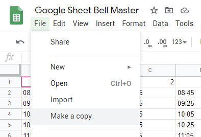

Connecting to Google Sheets
===========================

Getting the Template
--------------------
Follow this link - https://bit.ly/GSheetBellTemplate and make a copy



You can have an explore how it works, but the time inputs are next:

Layout and Rules
-------------------------

Their is a few custom scripts and formatting in the google sheet that you copied

 - The bell times on the main page (``MainTUI``) are taken, sorted and made more machine friendly and placed onto the ``DataSorted`` page. This process means you can have gaps in your bells and have them in any order. This is done through the use of named ranges. This can sometimes be mucked up by cutting and pasting, so if the second page is missing bells, make sure the Named Ranges look like they cover the range (They are under Data menu).

 - There is a hash script that supplies a hashing function used in the ``DataSorted`` page. It produces a hash that the Raspberry pi uses to work out if anything has changed to it's local copy (To reduce the number of writes to the SD card and chance of a corrupted local copy)

 - The bell registering area is capped to the space for a  thousand bells, that number is arbitrary but the sensing area has to be capped somewhere. If you want to extend this, you can by moving the hash cap down to where you want it and updating the Named Ranges from ending at 1000, to ending at your new end.

 - The bell times them selfs must be a 4 characters long, 24 hour and be separated by a colon. EG: 8:45 am: ``08:45`` | 2:30 pm: ``15:30``

You can add in your bell times now, if you want.

Google Cloud Platform
---------------------
If you have used GCloud before, you can skip this little section.

Go to `GCloud Console <https://console.cloud.google.com/>`_, accept the terms and conditions.
Now go to the `Google Sheet Quickstart <https://developers.google.com/sheets/api/quickstart/python>`_, click enable google sheet API.
Use the desktop client. Now save the Client ID and Client Secret somewhere and download the Client Configuration.

Next we need to generate the Token and the easiest way to do this is on your computer.

Download the `Repository <https://github.com/Fallstop/GSheetBells>`_ by either Cloning or Downloading a zip.

Open a Terminal (Command Line in windows) and cd to the location of the Local Repository. Make sure you have python3/pip installed and run:

.. note:: With Windows\, use python/pip command instead of python3/pip3

::

    pip3 install -r requirements.txt

While that is installing, you can place the credentials you downloaded earlier into the Python folder in the Repository and fill out the config file in the same folder.

Once both are done, run the script in the Python folder

::

    cd Python
    python3 BellRinger.py

It will take a bit to load, then it will open a webpage for you to authenticate it with the google account which has the Google Sheet. Check it has an error, if it dose, check your config.py is correct. If it works, your good to go.

Now we need to put the ``config.py`` and ```credentials.json`` onto the Raspberry Pi. You can do this how you normally do this kind of thing, or you can take the SD card out of the Raspberry Pi and Dump it into the ``home/pi/GSheetBells/Python/`` folder.
You can also do it via scp (If you have it installed), it would look like this:

::

    scp ./token.pickle pi@HostnameHere:~/GSheetBells/Python/token.pickle

Time to test it!

::

    cd ~/GSheetBells/Python
    python3 BellRinger.py

Sample Output

::

    Output here (Need to run on desktop)


If all works, then good, if it doesn't and you get a error message you can't work out, then good luck.

That is all you need to do for setting up Google Sheets!