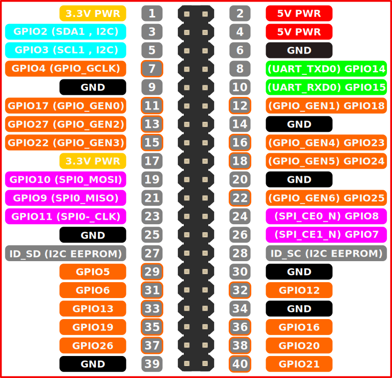

Wiring the components
=====================

This is one of the more complicated parts of tutorial, but it should be pretty easy once you get a grip on how it works.

Almost all of these stages are optional as you may not want to implement all of the features.

Default features that you can change:

 - Status LED's for internet (1 green, 1 red) and power (1 red LED).
 - Relay that protects the Raspberry Pi from the power of the existing setup and triggers the bells. This could in theory be simply replaced for a tone generator if your existing setup relies on that.
 - Mute bell switch, a switch that mutes the automatic ringing.
 - Ring now bell switch, a switch that bypasses the relay and forces the bells to ring.

I have split this into multiple parts that you can include or exclude.

Relay and switches
-------------------
These is the base parts that you probably want in your bell system, the relay to control actual bell system, and the ever convenient fast access switches on the top.
To get started, you need to plug/solder your electronics using this information:

 - Connect the data pin to pin 12 on the raspberry pi
 - The ring now switch just dose the job of the relay, just connect across the wires the relay uses
 - The mute switch just interrupts the wire going to the relays data pin.

This diagram will probably help, top left is nearest to the SD card on your raspberry pi:

Monitoring LED'S
----------------
Allows others and you to see what is wrong at a glance.